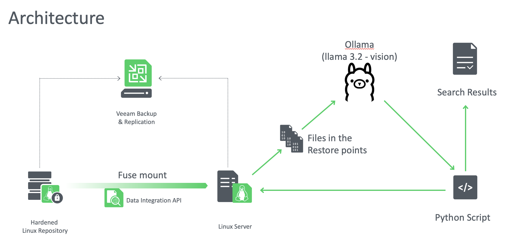

# Python Example for Veeam DataIntergration API and Ollama 

This script uses Ollama find objects in the pictures from the archived restore points.

## Architecture

## 📗 Documentation

Coming soon!

## ✍ Contributions

We welcome contributions from the community! We encourage you to create [issues](https://github.com/Coku2015/{repo-name}/issues/new/choose) for Bugs & Feature Requests and submit Pull Requests. For more detailed information, refer to our [Contributing Guide](CONTRIBUTING.md).

## 🤝🏾 License

* [MIT License](LICENSE)

## 🤔 Questions

If you have any questions or something is unclear, please don't hesitate to [create an issue](https://github.com/Coku2015/{repo-name}/issues/new/choose) and let us know!
